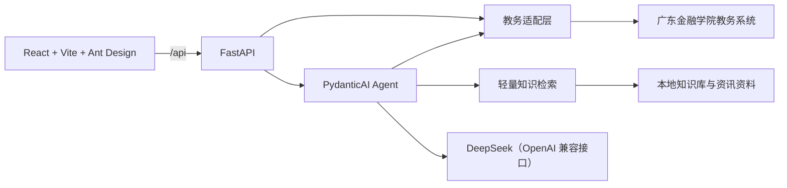

# 学院教学小助手

面向广东金融学院学生的教学信息助手。项目将教务系统查询、学院制度与资料检索，以及基于大模型的自然语言对话整合到一个 Web 应用中：学生既可以通过页面查询课表和成绩，也可以在对话中提出相同的问题。

> 这是一个学习/原型项目，并非学校官方系统或 SDK。涉及个人数据的查询依赖真实教务系统，使用时请遵守学校的信息系统使用规范。

## 功能概览

- **教务登录**：获取验证码、使用学号和密码登录、查询登录状态与退出登录。
- **个人教学信息**：查询个人课表、成绩及成绩明细、专业培养方案。
- **教室查询**：按学期、校区、教学楼和教学周查看教室占用课表。
- **AI 对话**：由 PydanticAI 驱动，按问题选择教务或检索工具，并将课表、成绩等结果以结构化卡片展示。
- **知识与资讯检索**：检索本地 Markdown、文本和 JSON 资料，结果附带来源。

## 架构



项目由三个主要部分组成：

| 目录 | 职责 | 核心技术 |
| --- | --- | --- |
| `front_end/web` | 浏览器界面、登录状态与结构化结果展示 | React 18、TypeScript、Vite、Ant Design、Axios |
| `back_end/backend` | API、会话管理、Agent 编排、知识检索 | Python 3.10+、FastAPI、PydanticAI、Pydantic Settings |
| `back_end/gdufjwxtapi` | 教务系统登录与旧版 JSP 页面解析 | httpx、Beautiful Soup 4 |

## 快速开始

### 前置条件

- Python 3.10 或更高版本
- Node.js 与 npm
- 可访问广东金融学院教务系统
- DeepSeek API Key（仅 AI 对话功能需要）

### 1. 启动后端

在 PowerShell 中执行：

```powershell
cd back_end\backend
python -m venv .venv
.\.venv\Scripts\Activate.ps1
python -m pip install --upgrade pip
python -m pip install -e ".[test]"
python -m pip install -e ..\gdufjwxtapi
Copy-Item .env.example .env
```

打开 `back_end/backend/.env`，至少填写有效的 `DEEPSEEK_API_KEY`：

```dotenv
DEEPSEEK_API_KEY=你的密钥
DEEPSEEK_BASE_URL=https://api.deepseek.com
DEEPSEEK_MODEL=deepseek-v4-flash
```

启动服务：

```powershell
python -m uvicorn app.main:app --reload --port 8000
```

后端健康检查地址为 <http://127.0.0.1:8000/>，交互式 API 文档为 <http://127.0.0.1:8000/docs>。

### 2. 启动前端

另开一个终端：

```powershell
cd front_end\web
npm ci
npm run dev
```

访问 <http://127.0.0.1:5173>。开发服务器会将 `/api` 代理到后端的 `http://127.0.0.1:8000`。

### 3. 使用流程

1. 打开前端，先获取验证码。
2. 输入教务系统的学号、密码和验证码完成登录。
3. 通过侧边栏进入课表、成绩、培养方案、教室课表或知识检索页面；也可以在首页发起对话。

## 配置项

后端从 `back_end/backend/.env` 读取配置，完整模板见 [`.env.example`](back_end/backend/.env.example)。

| 环境变量 | 默认值 | 说明 |
| --- | --- | --- |
| `DEEPSEEK_API_KEY` | 空 | DeepSeek 密钥；未配置时 AI 对话不可用 |
| `DEEPSEEK_BASE_URL` | `https://api.deepseek.com` | OpenAI 兼容接口地址 |
| `DEEPSEEK_MODEL` | `deepseek-v4-flash` | 对话模型名称 |
| `AGENT_MAX_ITERATIONS` | `4` | Agent 最大工具调用轮次（当前作为配置保留） |
| `AGENT_TIMEOUT_SECONDS` | `30` | Agent 超时配置（当前由模型客户端请求超时控制） |
| `JWXT_BASE_URL` | `https://jwxt.gduf.edu.cn` | 教务系统根地址 |
| `SESSION_TTL_MINUTES` | `120` | 后端内存会话的空闲过期时间（分钟） |
| `KNOWLEDGE_DIR` | `data/knowledge` | 知识库资料目录 |
| `INFORMATION_DIR` | `data/information` | 学院资讯与竞赛资料目录 |

请勿提交 `.env`，仓库已通过 `.gitignore` 忽略该文件。

## API 摘要

所有接口使用统一响应封装：

```json
{"success": true, "data": {}, "message": null}
```

失败响应会额外包含 `code`，例如 `AUTH_REQUIRED`、`AUTH_FAILED`、`SESSION_EXPIRED`、`MODEL_ERROR`。

| 方法 | 路径 | 登录要求 | 用途 |
| --- | --- | --- | --- |
| `POST` | `/api/auth/captcha` | 否 | 创建会话并获取验证码图片（Base64） |
| `POST` | `/api/auth/login` | 否 | 使用验证码登录教务系统 |
| `POST` | `/api/auth/logout` | 可选 | 退出并清除会话 |
| `GET` | `/api/auth/status` | 可选 | 查询登录状态 |
| `POST` | `/api/chat` | 可选 | AI 对话；个人教务数据须先登录 |
| `GET` | `/api/schedule` | 是 | 查询个人课表 |
| `GET` | `/api/classroom-schedule` | 是 | 查询教室课表 |
| `GET` | `/api/grades` | 是 | 查询成绩与学分/绩点统计 |
| `GET` | `/api/grades/{index}/detail` | 是 | 查询单科成绩构成 |
| `GET` | `/api/training-plan` | 是 | 查询培养方案 |
| `GET` | `/api/knowledge/search` | 否 | 检索知识库 |
| `GET` | `/api/information/search` | 否 | 检索学院资讯和竞赛信息 |

除 `POST /api/chat` 可以在请求体中提供 `session_token` 外，已登录接口通过请求头传递会话：

```http
X-Session-Token: <session_token>
```

## 数据与安全说明

- 后端为每位用户创建独立的 `JwxtClient`，以隔离 Cookie、登录状态和成绩查询上下文；会话仅保存在服务进程内存中，服务重启后会失效。
- 验证码与教务系统的 `JSESSIONID` 绑定，获取验证码与登录必须使用同一会话。
- 项目不会持久化学号和密码；前端仅将会话令牌保存在浏览器 `sessionStorage`。
- Agent 通过工具获取个人课表、成绩和培养方案，避免直接编造教务数据；未登录时会返回相应提示。
- 当前 CORS 为开发方便配置为允许全部来源。部署前应收紧 `allow_origins`，并将内存会话替换为适合生产环境的会话存储方案。

## 测试与构建

后端测试覆盖 API 基础行为、知识检索、Agent 工具注册与教务客户端解析。运行：

```powershell
# 后端服务测试
cd back_end\backend
.\.venv\Scripts\python -m pytest

# 教务客户端测试
cd ..\gdufjwxtapi
..\backend\.venv\Scripts\python -m pytest

# 前端类型检查与生产构建
cd ..\..\front_end\web
npm run build
```

教务客户端的大多数测试使用 `httpx.MockTransport` 模拟上游，不需要真实学号、密码或网络访问。`tests/test_real_responses.py` 另外依赖 `back_end/gdufjwxtapi/实际请求返回数据.md` 中的响应样本；该文件当前不在仓库内，因此在未补充样本时应跳过此项测试。

## 资料维护与当前限制

- `back_end/backend/data/knowledge/` 存放制度、培养方案等 Markdown 资料；`data/information/` 存放学院资讯和竞赛信息。服务启动时加载并按关键词评分检索。
- 当前检索属于零额外依赖的关键词检索，不是向量数据库；资料需人工更新。
- 学院资讯和竞赛信息目前为本地静态示例数据，尚未实现对学院网站或竞赛平台的自动同步。
- 教务解析依赖学校旧版 JSP 页面的结构；若页面改版，`gdufjwxtapi` 的解析器需要同步维护。
- AI 对话必须成功配置并能访问模型服务；教务功能还受学校系统可用性影响。

## 进一步阅读

- [后端说明](back_end/backend/README.md)
- [教务客户端 API 说明](back_end/gdufjwxtapi/README.md)
- [业务功能说明](docs/业务功能说明.md)
- [技术栈说明](docs/技术栈说明.md)
- [后端后续开发操作指南](docs/后端后续开发操作指南.md)
