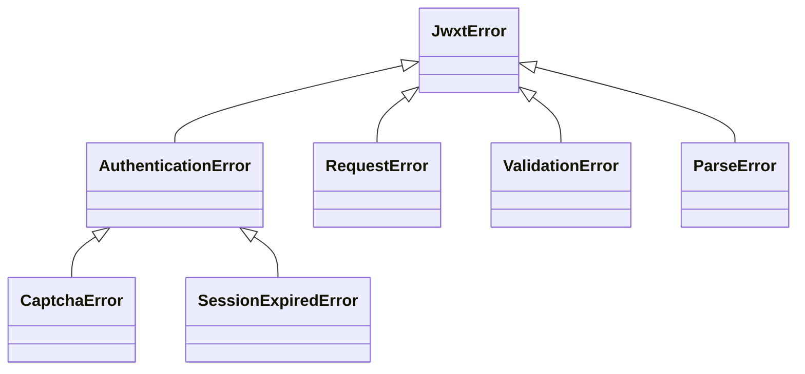

# jwxtapi

> 广东金融学院综合教务管理系统的同步 Python 客户端：封装验证码登录、会话保持与旧版 JSP 页面解析，返回类型化的数据对象。

[✨ 特性](#特性) · [🚀 快速开始](#快速开始) · [📦 安装](#安装) · [🧭 API 参考](#api-参考) · [⚠️ 异常处理](#异常处理) · [🧵 并发与多用户](#并发与多用户) · [🧪 开发与测试](#开发与测试) · [📁 项目结构](#项目结构) · [📌 已知限制](#已知限制) · [📄 免责声明](#免责声明)

---

## ✨ 特性

| 类别 | 说明 |
| --- | --- |
| 🔐 登录封装 | 验证码会话、凭据编码、学生主页二次校验，一个方法完成登录 |
| 🍪 会话管理 | Cookie 自动保持，提供 `keep_alive()` 手动保活、`logout()` 安全退出 |
| 📚 常用查询 | 个人课表、教室课表、成绩、成绩明细、培养方案、教学楼 |
| 🧱 类型化输出 | 全部返回冻结 dataclass，可 `to_dict()` 递归转字典 |
| 🧵 多用户隔离 | 一个实例对应一个账号，实例内请求由可重入锁串行保护 |
| 🛡️ 明确失败 | 统一 `JwxtError` 异常体系，解析失败显式抛出，不静默降级 |

## 🚀 快速开始

```bash
python -m pip install -e .
```

```python
from pathlib import Path

from jwxtapi import JwxtClient

with JwxtClient(timeout=15.0) as client:
    # 1. 获取验证码（与当前会话绑定）
    captcha = client.get_captcha()
    Path("captcha.jpg").write_bytes(captcha.content)

    # 2. 展示图片、收集用户输入，完成登录
    code = input("请输入 captcha.jpg 中的验证码：")
    client.login("学号", "密码", code)

    # 3. 查询课表与成绩
    schedule = client.get_schedule("2025-2026-2", week=1)
    for course in schedule.items:
        print(course.weekday, course.period, course.course_name)

    grades = client.get_grades()
    print(grades.to_dict())
```

> 💡 验证码与 `JSESSIONID` 绑定：获取验证码和登录必须使用**同一个** `JwxtClient` 实例。

## 📦 安装

- Python ≥ 3.10
- 运行依赖：`httpx`、`beautifulsoup4`

```bash
# 可编辑安装（直接使用源码，适合本项目）
python -m pip install -e .

# 含测试与开发依赖（pytest、mypy、build）
python -m pip install -e ".[test]"
```

接口行为示例见 [`tests/test_client.py`](tests/test_client.py)，使用 `httpx.MockTransport` 模拟教务系统，无需真实账号即可运行。

## 🧭 API 参考

### 使用约定

- 除 `get_captcha()` / `login()` 外，所有查询方法都要求当前实例已登录，否则抛出 `SessionExpiredError`。
- 网络层失败（超时、连接错误、非 2xx、客户端已关闭）统一抛出 `RequestError`。
- 页面结构不符合预期时抛出 `ParseError`，**不会**返回字段缺失的残缺结果。
- 所有返回类型均为冻结（frozen）dataclass，可调用 `to_dict()` 递归转字典；每个方法的返回值字段见下文对应条目。

### 方法总览

| 方法 | 返回类型 | 作用 |
| --- | --- | --- |
| `get_captcha()` | `CaptchaImage` | 建立新会话，获取验证码图片 |
| `login(username, password, captcha)` | `LoginResult` | 验证码登录 |
| `keep_alive()` | `bool` | 手动会话保活 |
| `logout()` | `None` | 退出并清空会话 |
| `get_schedule(term, week=None)` | `Schedule` | 个人课表 |
| `get_buildings(campus)` | `list[Option]` | 教学楼列表 |
| `get_classroom_schedule(...)` | `ClassroomSchedule` | 教室课表 |
| `get_grades(extra_form=None)` | `GradeReport` | 全部成绩 |
| `get_grade_detail(grade)` | `GradeDetail` | 单科成绩明细 |
| `get_training_plan(extra_form=None)` | `TrainingPlan` | 培养方案 |

### 构造与生命周期

#### `JwxtClient(base_url="https://jwxt.gduf.edu.cn", timeout=15.0, *, transport=None)`

构造时只初始化 HTTP 客户端，**不发起任何网络请求**。

| 参数 | 类型 | 默认值 | 说明 |
| --- | --- | --- | --- |
| `base_url` | `str` | `https://jwxt.gduf.edu.cn` | 教务系统根地址，一般无需修改 |
| `timeout` | `float` | `15.0` | 单个请求的超时秒数；必须 > 0，否则抛 `ValidationError` |
| `transport` | `httpx.BaseTransport \| None` | `None` | 仅测试用，可注入 `httpx.MockTransport` |

- `close()`：关闭连接池并清空会话；上下文管理器退出时自动调用，重复调用安全。
- `is_logged_in -> bool`：当前实例是否已登录。

### 登录与会话

#### `get_captcha() -> CaptchaImage`

清空旧会话 → 获取新 `JSESSIONID` → 返回验证码图片字节。无参数。

**返回 `CaptchaImage`**

| 字段 | 类型 | 说明 |
| --- | --- | --- |
| `content` | `bytes` | 验证码图片的原始字节 |
| `content_type` | `str` | 图片 MIME 类型，如 `image/jpeg` |

**注意**

- 只返回图片字节，不写文件、不做 OCR，需自行展示并收集用户输入；
- 每次调用都会使上一个验证码失效。

**异常**：`RequestError`（网络/HTTP 错误）、`CaptchaError`（接口未返回图片）。

#### `login(username, password, captcha) -> LoginResult`

| 参数 | 类型 | 必填 | 说明 |
| --- | --- | --- | --- |
| `username` | `str` | ✅ | 学号 |
| `password` | `str` | ✅ | 教务系统密码 |
| `captcha` | `str` | ✅ | 最新验证码图片中的文字 |

**返回 `LoginResult`**

| 字段 | 类型 | 说明 |
| --- | --- | --- |
| `success` | `bool` | 登录成功时恒为 `True` |
| `username` | `str` | 学号回显 |

**注意**

- 自动提交 `Base64(username) + "%%%" + Base64(password)`，再访问学生主页二次验证登录结果；
- 验证码一次性：无论成败都会作废，重试需重新 `get_captcha()`；
- 不保存账号和密码；成功后 `is_logged_in` 为 `True`。

**异常**：`ValidationError`（参数为空）、`CaptchaError`（未获取验证码或验证码错误）、`AuthenticationError`（账号/密码错误）、`ParseError`（响应异常）、`RequestError`。

#### `keep_alive() -> bool`

访问保活页面，延长当前会话有效期。无参数。

**返回**：`bool` —— 会话有效时返回 `True`。

**注意**：会话过期时抛 `SessionExpiredError` 并清空内部状态，需重新走验证码 + 登录流程。本包不提供后台保活线程，长驻程序请自行定时调用。

**异常**：`SessionExpiredError`、`RequestError`。

#### `logout() -> None`

调用退出接口，并清空 Cookie、登录状态与成绩登记。无参数、无返回值。

**注意**：未登录时调用也安全，重复调用安全。

### 查询接口

#### `get_schedule(term, week=None) -> Schedule`

| 参数 | 类型 | 必填 | 说明 |
| --- | --- | --- | --- |
| `term` | `str` | ✅ | 学年学期，如 `2025-2026-2`；格式或年份不连续抛 `ValidationError` |
| `week` | `int \| None` | — | 第几周（1–30），不传返回全部周 |

**返回 `Schedule`**

| 字段 | 类型 | 说明 |
| --- | --- | --- |
| `term` | `str` | 学年学期 |
| `week` | `int \| None` | 请求周次，`None` 为全部周 |
| `items` | `tuple[ScheduleEntry, ...]` | 课程列表 |
| `remarks` | `str \| None` | 课表备注，可能为 `None` |

**`items` 中的 `ScheduleEntry`**

| 字段 | 类型 | 说明 |
| --- | --- | --- |
| `course_name` | `str` | 课程名称 |
| `teacher` | `str \| None` | 教师 |
| `classroom` | `str \| None` | 教室 |
| `weeks_text` | `str` | 周次原文，如 `1-16周(单)` |
| `weeks` | `tuple[int, ...]` | 解析后的周次，升序排列 |
| `weekday` | `int` | 星期几，1–7 对应周一至周日 |
| `period` | `int` | 第几大节 |
| `period_name` | `str` | 节次名称，如 `第一大节` |

**实现细节**：内部会二次 POST，回填动态隐藏字段 `jx0415zbdiv_1/2` 以获取完整课表。

**异常**：`SessionExpiredError`、`ValidationError`、`ParseError`、`RequestError`。

#### `get_buildings(campus) -> list[Option]`

| 参数 | 类型 | 必填 | 说明 |
| --- | --- | --- | --- |
| `campus` | `str` | ✅ | 校区代码：`"1"` 本校区、`"2"` 肇庆校区、`"r0"` 清远校区 |

**返回 `list[Option]`**

| 字段 | 类型 | 说明 |
| --- | --- | --- |
| `value` | `str` | 教学楼代码，提交给 `get_classroom_schedule()` 的 `building` 参数 |
| `label` | `str` | 教学楼名称 |

**注意**：教学楼代码随学校数据变化，**不要硬编码**。

**异常**：`SessionExpiredError`、`ValidationError`（`campus` 为空）、`ParseError`、`RequestError`。

#### `get_classroom_schedule(term, department="", campus="", building="", start_week=None, end_week=None, start_period=None, end_period=None) -> ClassroomSchedule`

| 参数 | 类型 | 必填 | 默认值 | 说明 |
| --- | --- | --- | --- | --- |
| `term` | `str` | ✅ | — | 学年学期 |
| `department` | `str` | — | `""` | 院系代码，空表示不限 |
| `campus` | `str` | — | `""` | 校区代码，空表示不限 |
| `building` | `str` | — | `""` | 教学楼代码，建议用 `get_buildings()` 获取 |
| `start_week` / `end_week` | `int \| None` | — | `None` | 周次范围 1–30，`None` 表示不限 |
| `start_period` / `end_period` | `int \| None` | — | `None` | 节次范围，上限由学期联动接口动态确定 |

**返回 `ClassroomSchedule`**（查询条件回显 + 结果）

| 字段 | 类型 | 说明 |
| --- | --- | --- |
| `term` / `department` / `campus` / `building` | `str` | 查询条件回显 |
| `start_week` / `end_week` / `start_period` / `end_period` | `int \| None` | 查询条件回显 |
| `items` | `tuple[ClassroomEntry, ...]` | 教室占用条目 |

**`items` 中的 `ClassroomEntry`**

| 字段 | 类型 | 说明 |
| --- | --- | --- |
| `classroom` | `str` | 教室 |
| `weekday` | `int` | 星期，1–7 |
| `period` | `str` | 节次，如 `1-2` |
| `course_name` | `str` | 课程名称 |
| `teacher` | `str \| None` | 教师 |
| `weeks_text` | `str \| None` | 周次原文 |
| `weeks` | `tuple[int, ...]` | 解析后的周次 |
| `class_name` | `str \| None` | 班级 |
| `raw_text` | `str` | 单元格原始文本，便于排查解析问题 |

**异常**：`SessionExpiredError`、`ValidationError`（范围非法或开始值大于结束值）、`ParseError`、`RequestError`。

#### `get_grades(extra_form=None) -> GradeReport`

| 参数 | 类型 | 必填 | 默认值 | 说明 |
| --- | --- | --- | --- | --- |
| `extra_form` | `Mapping[str, str] \| None` | — | `None` | 额外表单字段，默认以空表单查询 |

**返回 `GradeReport`**

| 字段 | 类型 | 说明 |
| --- | --- | --- |
| `required_credits` | `str \| None` | 总需学分 |
| `earned_credits` | `str \| None` | 已修学分 |
| `remaining_credits` | `str \| None` | 剩余学分 |
| `major_gpa` | `str \| None` | 主修课程平均绩点 |
| `minor_gpa` | `str \| None` | 辅修课程平均绩点 |
| `items` | `tuple[Grade, ...]` | 成绩列表 |

**`items` 中的 `Grade`**

| 字段 | 类型 | 说明 |
| --- | --- | --- |
| `index` | `int` | 序号 |
| `term` | `str` | 开课学期 |
| `course_code` | `str` | 课程编号 |
| `course_name` | `str` | 课程名称 |
| `score` | `str` | 成绩，保持字符串以兼容 `优秀`、`合格` 等值 |
| `credit` | `str` | 学分 |
| `total_hours` | `str` | 总学时 |
| `grade_point` | `str` | 绩点 |
| `assessment_method` | `str` | 考核方式 |
| `course_attribute` | `str` | 课程属性 |
| `course_nature` | `str` | 课程性质 |
| `student_id` | `str \| None` | 明细链接中的学生 ID |
| `teaching_task_id` | `str \| None` | 明细链接中的教学任务 ID |
| `detail_total_score` | `str \| None` | 明细链接中的总成绩参数 |

**属性**：`has_detail -> bool`，上述三个明细字段齐全时为 `True`，表示可调用 `get_grade_detail()`。

> ⚠️ 本方法会刷新实例的成绩登记表，之后 `get_grade_detail()` 只接受本次返回的 `Grade` 对象。

**异常**：`SessionExpiredError`、`ParseError`、`RequestError`。

#### `get_grade_detail(grade) -> GradeDetail`

| 参数 | 类型 | 必填 | 说明 |
| --- | --- | --- | --- |
| `grade` | `Grade` | ✅ | **本实例**最近一次 `get_grades()` 返回、且 `has_detail` 为 `True` 的对象 |

**返回 `GradeDetail`**（所有字段均为字符串）

| 字段 | 类型 | 说明 |
| --- | --- | --- |
| `final_score` | `str` | 期末成绩 |
| `final_ratio` | `str` | 期末成绩比例 |
| `midterm_score` | `str` | 期中成绩 |
| `midterm_ratio` | `str` | 期中成绩比例 |
| `regular_score` | `str` | 平时成绩 |
| `regular_ratio` | `str` | 平时成绩比例 |
| `total_score` | `str` | 总成绩 |

**异常**：`ValidationError`（传入其他实例或过期对象、或该成绩无明细）、`SessionExpiredError`、`ParseError`、`RequestError`。

#### `get_training_plan(extra_form=None) -> TrainingPlan`

| 参数 | 类型 | 必填 | 默认值 | 说明 |
| --- | --- | --- | --- | --- |
| `extra_form` | `Mapping[str, str] \| None` | — | `None` | 额外表单字段，默认以空表单查询 |

**返回 `TrainingPlan`**

| 字段 | 类型 | 说明 |
| --- | --- | --- |
| `items` | `tuple[TrainingPlanCourse, ...]` | 培养方案课程列表 |

**`items` 中的 `TrainingPlanCourse`**

| 字段 | 类型 | 说明 |
| --- | --- | --- |
| `index` | `int` | 序号 |
| `term` | `str` | 开课学期 |
| `course_code` | `str` | 课程编号 |
| `course_name` | `str` | 课程名称 |
| `department` | `str` | 开课单位 |
| `credit` | `str` | 学分 |
| `total_hours` | `str` | 总学时 |
| `assessment_method` | `str` | 考核方式 |
| `course_attribute` | `str` | 课程属性 |
| `is_exam` | `str` | 是否考试 |

**异常**：`SessionExpiredError`、`ParseError`、`RequestError`。

## ⚠️ 异常处理

所有异常均继承自 `JwxtError`：



| 异常 | 触发场景 |
| --- | --- |
| `CaptchaError` | 未先获取验证码、验证码响应无效或验证码错误 |
| `AuthenticationError` | 账号或密码错误 |
| `SessionExpiredError` | 未登录或会话已过期 |
| `RequestError` | 超时、连接错误、HTTP 错误、客户端已关闭 |
| `ValidationError` | 学期格式、周次/节次范围、调用对象不合法 |
| `ParseError` | 页面结构变化、关键字段缺失 |

```python
from jwxtapi import CaptchaError, JwxtError, SessionExpiredError

try:
    client.login(username, password, captcha)
except CaptchaError:
    client.get_captcha()          # 验证码错误，换一张重试
except SessionExpiredError:
    # 重新走 get_captcha() + login() 流程
    pass
except JwxtError as exc:
    print(f"调用失败：{exc}")
```

## 🧵 并发与多用户

一个账号一个实例。每个实例拥有独立的连接池、Cookie、登录状态、锁与成绩登记，不使用模块级 Session。

```python
from concurrent.futures import ThreadPoolExecutor

from jwxtapi import JwxtClient


def query_user(username: str, password: str, captcha: str):
    with JwxtClient() as client:
        client.get_captcha()
        client.login(username, password, captcha)
        return client.get_grades().to_dict()


with ThreadPoolExecutor(max_workers=2) as pool:
    # 实际程序应先分别展示两个客户端获取到的验证码，再提交对应文字
    futures = [
        pool.submit(query_user, "用户A", "密码A", "验证码A"),
        pool.submit(query_user, "用户B", "密码B", "验证码B"),
    ]
```

同一实例内的请求由可重入锁串行化；不同实例可跨线程并行。不要让同一实例在多个账号间切换。

## 🧪 开发与测试

```bash
pytest                 # 运行全部测试（MockTransport 离线模拟，无需真实账号）
mypy                   # strict 类型检查
python -m build        # 构建 wheel 与 sdist
```

## 📁 项目结构

```text
jwxtapi/
├── src/jwxtapi/
│   ├── client.py        # JwxtClient：登录、会话与全部查询
│   ├── models.py        # 冻结 dataclass 数据模型
│   ├── parsers.py       # 旧 JSP HTML 解析
│   ├── exceptions.py    # JwxtError 异常体系
│   └── py.typed         # PEP 561 类型标记
└── tests/               # 离线测试
```

## 📌 已知限制

- 成绩（`/jsxsd/kscj/cjcx_list`）与培养方案（`/jsxsd/pyfa/pyfa_query`）默认以空表单 POST 查询；若你的账号需要额外字段，请通过 `extra_form` 传入，并将浏览器 Network 中的 Form Data 反馈给项目。
- 不提供异步客户端、验证码 OCR、后台自动保活与 Cookie 持久化。
- 解析器依赖学校旧版 JSP 页面结构，页面改版后需要同步更新解析逻辑。

## 📄 免责声明

本项目**不是**广东金融学院官方 SDK，仅用于学习与个人自动化场景。请遵守学校信息系统使用规定，合理控制请求频率，勿将其用于任何影响系统正常运行的用途。
